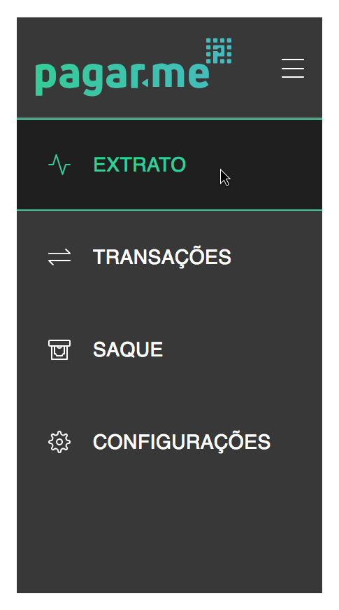

# Consultando seu extrato

Na tela de Extrato da sua Dashboard você pode encontrar as movimentações e os lançamentos realizados na sua conta Pagar.me. Para acessá-la siga o caminho Menu > Extrato.

  

Nesta mesma página é possível visualizar o quanto sua conta tem disponível para Saque e para Antecipação, você pode saber mais sobre eles nos artigos [**Realizando um saque**](https://github.com/pagarme/Manual-Pilot-Alfa/blob/master/Extrato/Sacar.md) e [**Realizando uma antecipação**](https://github.com/pagarme/Manual-Pilot-Alfa/blob/master/Extrato/Antecipar.md). Em "Solicitaçõs recentes", você pode ver quais foram os últimos saques e antecipações realizadas pela sua conta. 

  

Logo abaixo, você pode selecionar o período de lançamentos que deseja ver, utilizando o calendário da imagem abaixo. Depois de selecionar os dias, clique em "Filtrar" e a visualização estará personalizada. :) 

  

Após filtrar o período, é possível ver um resumo com:**total de entradas**, **total de saídas** e o **total líquido** (resultado da subtração do total de saídas menos o total de entradas). 

- Entradas: tudo o que entrou na sua conta Pagar.me, como parcelas recebidas, antecipações, restituição de chargeback etc. 

- Saídas: tudo o que saiu da sua conta Pagar.me, como saques realizados, descontos de MDR, cobranças de gateway e antifraude etc. 

  

Para visualizar os valores discriminadamente, você pode descer um pouco nesta mesma tela e utilizar a tabela "Lançamentos do Periodo". Nela, você pode ver todos os lançamentos do período selecionado acima (no topo da tela),  o quanto foi descontado (saídas) de cada entrada e o total líquido de cada uma. 

  

Caso você deseje consultar as movimentações de outro período, suba até o início da página e selecione outra aba ou altere o período utilizando o calendário e depois clique em "Filtrar". 
