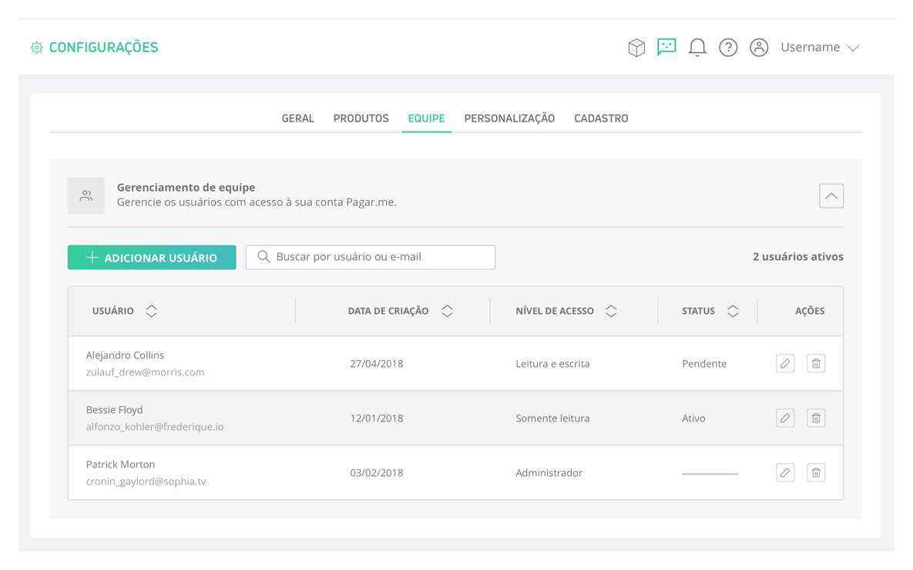
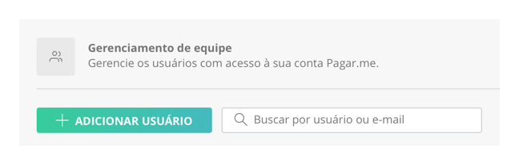
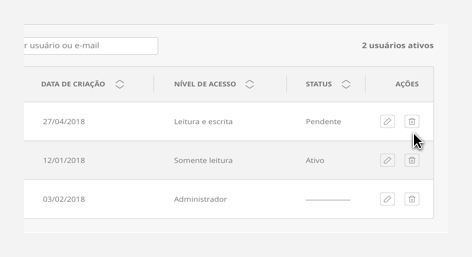

# Gerenciando sua equipe 

É possível cadastrar mais de um usuário para acessar a Dashboard do Pagar.me. Além disso, eles podem ter também diferentes níveis de acesso, facilitando sua operação e protegendo informações sensíveis. 

Para cadastrar sua equipe, acesse sua Dashboard e siga o caminho Menu > Configurações > Equipe. Na tela que é aberta, é possível visualizar os usuários cadastrados, por padrão o usuário administrador já está cadastrado. Para isso, que clique na setinha localizada no canto superior direito. 

Na tabela de usuários é possível ver o nome, a data em que ele foi criado, o nível de acesso dele, seu status e também excluí-lo.

 

## Adicionando um usuário 

Para adicionar um novo usuário, clique no botão "Adicionar usuário", localizado ao lado da busca. 

 

No modal em que é aberto, depois de adicionar o e-mail do usuário, é necessário escolher o seu nível de acesso, que pode ser:

 **- Somente leitura**: pode visualizar os dados da Dashboard (exceto as chaves de API e os membros da equipe), não podendo realizar nenhum tipo de operação.
 
 **- Leitura e escrita**: além de visualizar os dados da Dashboard (exceto as chaves de API e os membros da equipe), pode realizar antecipações e adicionar planos, transações e clientes. Porém, não pode realizar saques.
 
 **- Administrador**: possível executar todas as operações, visualizar as chaves de API, ver e adicionar outros membros da equipe.
 
Depois de apertar o botão de "Confirmar", o usuário cadastrado recebe um e-mail para preencher todos os seus dados e poder acessar à Dashboard. Enquanto isso, seu status fica como "Pendente". 
 
## Excluindo um usuário

Para excluir um membro da sua equipe, acesse sua Dashboard e siga o caminho Menu > Configurações > Equipe. Clique no ícone de lixeira do usuário desejado, na coluna "Ações" da tabela. 

 

No modal que é aberto, você pode confirmar ou cancelar a exclusão do usuário. :) 

