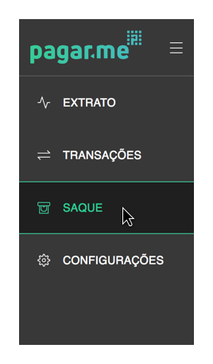

# Realizando um saque 

Você pode sacar os valores da sua conta Pagar.me sempre que houver saldo disponível. Para isso,clique em "Sacar" no menu lateral da sua Dashboard ou acesse a tela de Extrato na sua Dashboard, seguindo o caminho Menu > Extrato. 

Nesta tela é possível visualizar o quanto você pode sacar, e se houver saldo, solicitar o saque clicando em "Sacar". 

  

  

Agora é só preencher o valor do saque e clicar em "Continuar" para prosseguir a tarefa. Vale ressaltar que nesta mesma página, você consegue consultar o custo da transferência (quando é feito um saque, é realizada uma transferência da sua conta Pagar.me para a conta corrente em questão, por isso o banco cobra uma taxa de transferência pelo serviço realizado), e quanto será o valor líquido. Isto é, a quantia que será efevetivamente recebida, sendo o resultado do valor solicitado menos o custo da transferência. 

O próximo passo é necessário para você possa conferir os dados desta transferência e confirmá-los. Caso você queira alterar alguma informação, é só clicar no botão "Voltar", localizado no canto inferior esquerdo, e mudar o que foi necessário. 
Pedimos sua senha nesta etapa, pois se tratar de uma operação sensível, então tenha-a sempre em mente. :) 

  

Pronto! Depois de realizado o saque, para voltar à visualização normal você pode utilizar o menu lateral, clicando na página que deseja visualizar. 

